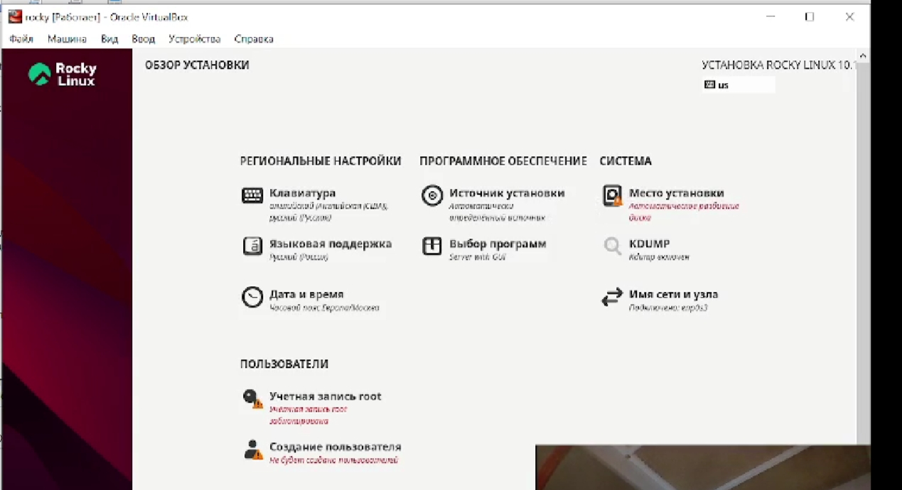
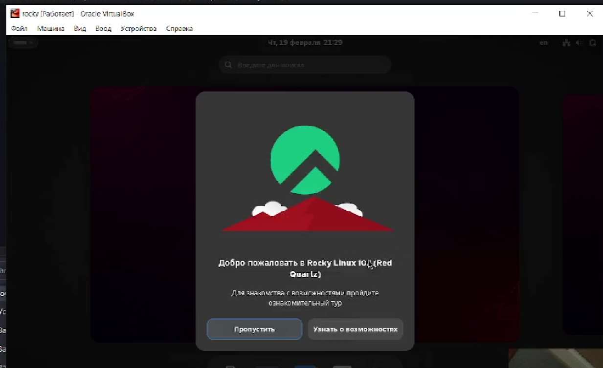

---
author:
  name: Самойлова Софья Дмитриевна
  email: 1132246736@rudn.ru
  affiliation:
    - name: Российский университет дружбы народов
      country: Российская Федерация
      postal-code: 117198
      city: Москва
      address: ул. Миклухо-Маклая, д. 6
title: Отчёт по лабораторной работе №1
subtitle: Установка и настройка операционной системы
date: today
date-format: "YYYY-MM-DD"
format:
  revealjs:
    slide-level: 2
    theme: beige
    transition: slide
---

# Информация

## Легенда преподаватель

:::::::::::::: {.columns align=center}
::: {.column width="70%"}

  * Кулябов Дмитрий Сергеевич
  * д.ф.-м.н., профессор
  * профессор кафедры теории вероятностей и кибербезопасности
  * Российский университет дружбы народов им. П. Лумумбы
  * [kulyabov-ds@rudn.ru](mailto:kulyabov-ds@rudn.ru)
  * <https://yamadharma.github.io/ru/>

:::
::: {.column width="30%"}

:::
::::::::::::::

## Докладчик

:::::::::::::: {.columns align=center}
::: {.column width="70%"}

  * Самойлова Софья Дмитриевна
  * студентка
  * Российский университет дружбы народов им. П. Лумумбы
  * [1132246736@rudn.ru](mailto:1132246736@rudn.ru)

:::
::: {.column width="30%"}

:::
::::::::::::::

# Цель работы

## Цель работы

Целью данной работы является приобретение практических навыков установки операционной системы на виртуальную машину, настройки минимально необходимых для дальнейшей работы сервисов.

# Задание

## Задание

1. Установка операционной системы на виртуальную машину.
2. Первоначальная настройка установленной операционной системы.

# Выполнение лабораторной работы

## Подготовка к установке

Для выполнения работы было необходимо скачать необходимое программное обеспечение:

- Гипервизор (Oracle VM VirtualBox)
- Дистрибутив операционной системы Linux (Rocky Linux) с официального сайта (<https://rockylinux.org/>)

## Настройка виртуальной машины

В программе VirtualBox была создана новая виртуальная машина и выполнены ее предварительные настройки, такие как выделение оперативной памяти, создание виртуального жесткого диска и подключение образа ISO для установки.

{width=70%}

## Процесс установки ОС

После запуска виртуальной машины началась установка системы. На этапе выбора языка интерфейса был указан Русский, после чего я перешла к основным настройкам установки, таким как выбор диска для установки и настройка сетевых интерфейсов.

{width=70%}

## Завершение установки

По завершении установки операционной системы виртуальная машина была корректно перезапущена. При первом запуске после установки система запросила принятие условий лицензионного соглашения, что и было выполнено.

{width=70%}

# Информация о системе

## Информация о системе

После установки и первоначального входа в систему была получена следующая информация о ней с помощью соответствующих команд терминала.

- **Версия ядра Linux:** 6.12.0-124.8.1.el10_1.x86_64 (получена с помощью команды `uname -r`)
- **Частота процессора:** 2096.062 МГц (информация из файла `/proc/cpuinfo`, команда `lscpu`)
- **Модель процессора:** AMD Ryzen 5 5500U with Radeon Graphics

## Информация о системе (продолжение)

- **Объем доступной оперативной памяти:** Всего доступно около 1200348 kB (примерно 1.14 ГБ), информацию можно получить с помощью команды `free -h` или из файла `/proc/meminfo`
- **Тип обнаруженного гипервизора:** oracle (что соответствует Oracle VM VirtualBox). Информация получена с помощью команды `systemd-detect-virt`
- **Тип файловой системы корневого раздела (/):** xfs. Тип файловой системы для конкретного раздела можно узнать с помощью команды `lsblk -f` или `findmnt -T /`

# Контрольные вопросы

## Учётная запись пользователя

**Какую информацию содержит учётная запись пользователя?**

Учетная запись пользователя в Linux содержит следующую информацию, которая хранится в файле `/etc/passwd`:

- **Имя пользователя (username):** Используется для входа в систему
- **Идентификатор пользователя (UID):** Уникальный числовой идентификатор
- **Идентификатор группы (GID):** Числовой идентификатор основной группы
- **Домашний каталог (home directory):** Путь до каталога пользователя

## Учётная запись пользователя (продолжение)

- **Командная оболочка (shell):** Программа, которая запускается после входа (например, `/bin/bash`)
- **Зашифрованный пароль (или его указатель):** Сами пароли хранятся в файле `/etc/shadow`
- **GECOS (описание):** Дополнительное поле для хранения реального имени, контактной информации

# Команды терминала

## Команды для получения справки

- `man <команда>` — отображает подробное руководство по команде
  - Пример: `man ls`
- `<команда> --help` — отображает краткую справку по использованию команды
  - Пример: `ls --help`

## Команды для перемещения по файловой системе

- `cd /home/user` — переход в каталог `/home/user`
- `cd ..` — переход на один уровень вверх (в родительский каталог)
- `cd ~` или `cd` — переход в домашний каталог текущего пользователя
- `cd -` — переход в предыдущий каталог

## Команды для просмотра содержимого каталога

- `ls` — отображает список файлов и папок в текущем каталоге
- `ls -l` — отображает список в подробном формате
- `ls -a` — отображает все файлы, включая скрытые
- `ls -lh` — отображает список в подробном формате с размерами в удобном для чтения виде

## Команды для определения объёма

- `du -sh <каталог>` — показывает общий размер указанного каталога
  - Пример: `du -sh /home/user`
- `du -h` — показывает размеры всех подкаталогов в текущем каталоге
- `df -h` — показывает информацию о смонтированных файловых системах

## Команды для создания и удаления

- `mkdir <имя_каталога>` — создание нового каталога
- `touch <имя_файла>` — создание пустого файла
- `rm <файл>` — удаление файла
- `rm -r <каталог>` — рекурсивное удаление каталога
- `rmdir <пустой_каталог>` — удаление только пустого каталога

## Команды для копирования и перемещения

- `cp <источник> <назначение>` — копирование файла или каталога
- `mv <источник> <назначение>` — перемещение или переименование файла/каталога

## Команды для задания прав

- `chmod 755 script.sh` — установка прав в числовом формате
- `chmod u+x file.txt` — добавление права на выполнение для владельца
- `chmod go-w file.txt` — удаление права на запись для группы и остальных
- `chown user:group file.txt` — смена владельца и группы файла

## Команды для просмотра истории

- `history` — показывает список последних введенных команд с номерами
- `history 10` — показывает последние 10 команд
- `!!` — повторяет последнюю выполненную команду
- `!100` — выполняет команду с номером 100 из истории
- `Ctrl+R` — поиск по истории команд

# Файловая система

## Что такое файловая система?

Файловая система (ФС) — это способ организации, хранения и именования данных на носителях информации (жестких дисках, SSD, флеш-накопителях). Она определяет структуру, максимальный размер файла и раздела, методы доступа к данным.

## Примеры файловых систем: ext4

**ext4 (Fourth Extended Filesystem):**

- Журналируемая файловая система
- Стандартная для многих дистрибутивов Linux
- Поддерживает очень большие файлы и разделы
- Высокая производительность
- Обратная совместимость с ext2/ext3

## Примеры файловых систем: XFS

**XFS:**

- Высокопроизводительная журналируемая файловая система
- Разработана SGI
- Отлично подходит для систем с высокой нагрузкой
- Хорошо работает с большими файлами (мультимедиа, базы данных)
- Хорошо масштабируется на многопроцессорных системах

## Примеры файловых систем: Btrfs

**Btrfs (B-Tree File System):**

- Современная файловая система
- Поддерживает механизмы "копирования при записи" (copy-on-write)
- Снапшоты
- Сжатие на лету
- Проверка целостности данных
- Объединение томов

## Примеры файловых систем: NTFS

**NTFS (New Technology File System):**

- Журналируемая файловая система от Microsoft
- Основная для Windows
- Поддерживает большие файлы
- Разграничение прав доступа
- Шифрование и сжатие
- Поддерживается в Linux (драйвер `ntfs-3g`)

## Примеры файловых систем: FAT32

**FAT32 (File Allocation Table):**

- Устаревшая, но широко совместимая файловая система
- Поддерживается почти всеми ОС
- Не журналируемая
- Максимальный размер файла — 4 ГБ
- Часто используется на USB-флешках

# Просмотр смонтированных ФС

## Как посмотреть смонтированные файловые системы?

- `mount` — выводит список всех смонтированных файловых систем
- `df -h` — показывает информацию о смонтированных файловых системах
- `findmnt` — выводит список смонтированных ФС в виде древовидной структуры
- `cat /proc/mounts` — просмотр специального файла ядра с информацией о смонтированных ФС

# Удаление процессов

## Как удалить зависший процесс?

**Шаг 1: Найти идентификатор процесса (PID) или его точное имя**

- `ps aux | grep <имя_процесса>` — поиск процесса по имени
- `top` или `htop` — интерактивные программы для просмотра процессов
- `pidof <имя_процесса>` — показывает PID процесса по его имени

## Как удалить зависший процесс? (продолжение)

**Шаг 2: Отправить сигнал завершения**

- `kill <PID>` — отправляет процессу сигнал `SIGTERM` (корректное завершение)
- `kill -9 <PID>` или `kill -SIGKILL <PID>` — принудительное завершение (крайняя мера)
- `pkill <имя_процесса>` — отправляет сигнал всем процессам с указанным именем
- `killall <имя_процесса>` — аналогично `pkill`

# Выводы

## Выводы

В ходе выполнения лабораторной работы я приобрела практические навыки установки операционной системы Linux (дистрибутив Rocky) на виртуальную машину, а также выполнила ее первоначальную настройку, необходимую для дальнейшей работы.

# Список литературы

## Список литературы

1. [Rocky Linux Official Website](https://rockylinux.org/)
2. [Oracle VM VirtualBox Official Website](https://www.virtualbox.org/)
3. Материалы курса "Операционные системы" РУДН.
