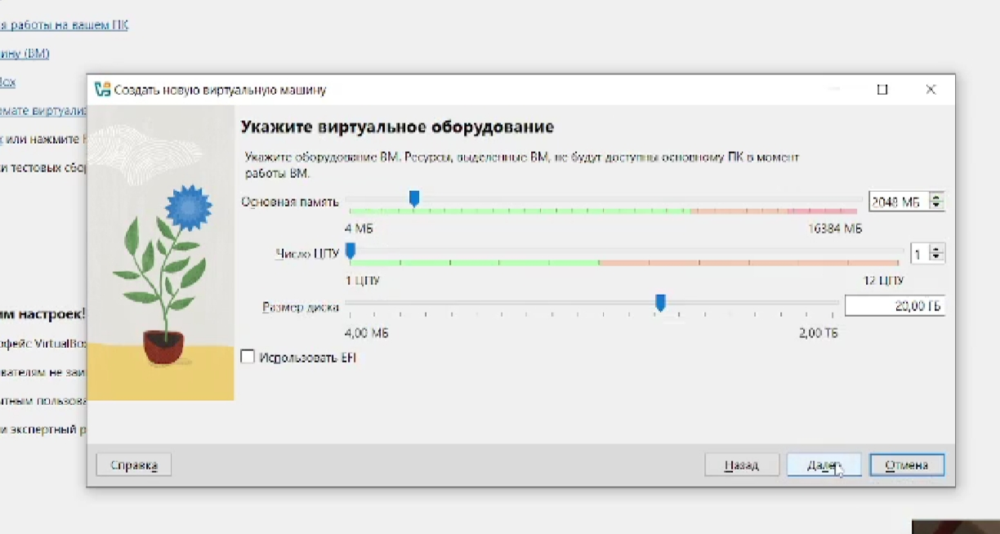

---
author:
  - name: Самойлова Софья Дмитриевна
    email: 1132246736@rudn.ru
    affiliation:
      - name: Российский университет дружбы народов
        country: Российская Федерация
        address: ул. Миклухо-Маклая, д. 6
        city: Москва
        postal-code: 117198
title: "Отчёт по лабораторной работе №1"
---

# Цель работы

Целью данной работы является приобретение практических навыков установки операционной системы на виртуальную машину, настройки минимально необходимых для дальнейшей работы сервисов.

# Задание

1.  Установка операционной системы на виртуальную машину.
2.  Первоначальная настройка установленной операционной системы.

# Выполнение лабораторной работы

Для выполнения работы было необходимо скачать необходимое программное обеспечение: гипервизор (в данном случае Oracle VM VirtualBox) и дистрибутив операционной системы Linux (Rocky Linux) с официального сайта (<https://rockylinux.org/>).

В программе VirtualBox была создана новая виртуальная машина и выполнены ее предварительные настройки, такие как выделение оперативной памяти, создание виртуального жесткого диска и подключение образа ISO для установки ([рис. -@fig:001]).

{#fig:001 width=70%}

После запуска виртуальной машины началась установка системы. На этапе выбора языка интерфейса был указан Русский, после чего я перешла к основным настройкам установки, таким как выбор диска для установки и настройка сетевых интерфейсов ([рис. -@fig:002]).

{#fig:002 width=70%}

По завершении установки операционной системы виртуальная машина была корректно перезапущена. При первом запуске после установки система запросила принятие условий лицензионного соглашения, что и было выполнено ([рис. -@fig:003]).

{#fig:003 width=70%}

# Информация о системе

После установки и первоначального входа в систему была получена следующая информация о ней с помощью соответствующих команд терминала.

-   **Версия ядра Linux:** 6.12.0-124.8.1.el10_1.x86_64 (получена с помощью команды `uname -r`).
-   **Частота процессора:** 2096.062 МГц (информация из файла `/proc/cpuinfo`, команда `lscpu`).
-   **Модель процессора:** AMD Ryzen 5 5500U with Radeon Graphics (информация из файла `/proc/cpuinfo`, команда `lscpu`).
-   **Объем доступной оперативной памяти:** Всего доступно около 1200348 kB (примерно 1.14 ГБ), информацию можно получить с помощью команды `free -h` или из файла `/proc/meminfo`.
-   **Тип обнаруженного гипервизора:** oracle (что соответствует Oracle VM VirtualBox). Информация получена с помощью команды `systemd-detect-virt` или из файла `/sys/hypervisor/type` (если существует).
-   **Тип файловой системы корневого раздела (/):** xfs. Тип файловой системы для конкретного раздела можно узнать с помощью команды `lsblk -f` или `findmnt -T /`.

# Контрольные вопросы

**1. Какую информацию содержит учётная запись пользователя?**

Учетная запись пользователя в Linux содержит следующую информацию, которая хранится в файле `/etc/passwd` (кроме пароля):

-   **Имя пользователя (username):** Используется для входа в систему.
-   **Идентификатор пользователя (UID):** Уникальный числовой идентификатор.
-   **Идентификатор группы (GID):** Числовой идентификатор основной группы пользователя.
-   **Домашний каталог (home directory):** Абсолютный путь до каталога, в который попадает пользователь после входа.
-   **Командная оболочка (shell):** Программа, которая запускается после входа в систему (например, `/bin/bash`).
-   **Зашифрованный пароль (или его указатель):** Сами пароли хранятся в файле `/etc/shadow`.
-   **GECOS (описание):** Дополнительное поле для хранения реального имени, контактной информации и т.д.

**2. Команды терминала и примеры:**

-   **Справка по команде:**
    -   `man <команда>` — отображает подробное руководство по команде. Пример: `man ls`.
    -   `<команда> --help` — отображает краткую справку по использованию команды. Пример: `ls --help`.

-   **Перемещение по файловой системе (команда `cd`):**
    -   `cd /home/user` — переход в каталог `/home/user`.
    -   `cd ..` — переход на один уровень вверх (в родительский каталог).
    -   `cd ~` или `cd` — переход в домашний каталог текущего пользователя.
    -   `cd -` — переход в предыдущий каталог.

-   **Просмотр содержимого каталога (команда `ls`):**
    -   `ls` — отображает список файлов и папок в текущем каталоге.
    -   `ls -l` — отображает список в подробном формате (права доступа, владелец, размер, дата изменения).
    -   `ls -a` — отображает все файлы, включая скрытые (начинающиеся с точки).
    -   `ls -lh` — отображает список в подробном формате с размерами в удобном для чтения виде (КБ, МБ, ГБ).

-   **Определение объёма каталога и дисков:**
    -   `du -sh <каталог>` — показывает общий размер указанного каталога. `-s` (summary) - итог, `-h` (human-readable) - удобный формат. Пример: `du -sh /home/user`.
    -   `du -h` — показывает размеры всех подкаталогов в текущем каталоге.
    -   `df -h` — показывает информацию о смонтированных файловых системах (размер, занято, свободно, точка монтирования).

-   **Создание и удаление каталогов и файлов:**
    -   `mkdir <имя_каталога>` — создание нового каталога.
    -   `touch <имя_файла>` — создание пустого файла или обновление времени его модификации.
    -   `rm <файл>` — удаление файла.
    -   `rm -r <каталог>` — рекурсивное удаление каталога и всего его содержимого.
    -   `rmdir <пустой_каталог>` — удаление только пустого каталога.
    -   `cp <источник> <назначение>` — копирование файла или каталога.
    -   `mv <источник> <назначение>` — перемещение или переименование файла/каталога.

-   **Задание прав на файл или каталог (команда `chmod`):**
    -   `chmod 755 script.sh` — установка прав в числовом формате (владелец: чтение, запись, выполнение; группа: чтение, выполнение; остальные: чтение, выполнение).
    -   `chmod u+x file.txt` — добавление права на выполнение (`+x`) для владельца (`u`).
    -   `chmod go-w file.txt` — удаление права на запись (`-w`) для группы (`g`) и остальных (`o`).
    -   `chown user:group file.txt` — смена владельца (`user`) и группы (`group`) файла.

-   **Просмотр истории команд:**
    -   `history` — показывает список последних введенных команд с номерами.
    -   `history 10` — показывает последние 10 команд.
    -   `!!` — повторяет последнюю выполненную команду.
    -   `!100` — выполняет команду с номером 100 из истории.
    -   `Ctrl+R` — поиск по истории команд (reverse-i-search).

**3. Что такое файловая система? Примеры с характеристикой.**

Файловая система (ФС) — это способ организации, хранения и именования данных на носителях информации (жестких дисках, SSD, флеш-накопителях). Она определяет структуру, максимальный размер файла и раздела, методы доступа к данным и, часто, функции журналирования для обеспечения целостности.

Примеры файловых систем с характеристиками:

-   **ext4 (Fourth Extended Filesystem):** Журналируемая файловая система, которая является стандартной для многих дистрибутивов Linux. Поддерживает очень большие файлы и разделы, высокую производительность и обратную совместимость с ext2/ext3.
-   **XFS:** Высокопроизводительная журналируемая файловая система, разработанная SGI. Отлично подходит для систем с высокой нагрузкой и большими файлами (например, мультимедиа, базы данных). Хорошо масштабируется на многопроцессорных системах.
-   **Btrfs (B-Tree File System):** Современная файловая система, которая поддерживает механизмы "копирования при записи" (copy-on-write), снапшоты, сжатие на лету, проверку целостности данных (суммы) и объединение томов (RAID-like функции).
-   **NTFS (New Technology File System):** Журналируемая файловая система, разработанная Microsoft для Windows. Поддерживает большие файлы, разграничение прав доступа, шифрование, сжатие и жесткие ссылки. Является основной для Windows, но также может использоваться в Linux (обычно с драйвером `ntfs-3g`).
-   **FAT32 (File Allocation Table):** Устаревшая, но широко совместимая файловая система (поддерживается почти всеми ОС). Не журналируемая, имеет главный недостаток — максимальный размер файла не может превышать 4 ГБ. Часто используется на USB-флешках для совместимости.

**4. Как посмотреть, какие файловые системы подмонтированы в ОС?**

Для просмотра списка смонтированных файловых систем можно использовать следующие команды:

-   `mount` — без аргументов выводит список всех смонтированных файловых систем.
-   `df -h` — показывает информацию о смонтированных файловых системах (точку монтирования, размер, занятое место). Опция `-h` делает вывод удобочитаемым.
-   `findmnt` — выводит список смонтированных файловых систем в виде древовидной структуры.
-   `cat /proc/mounts` — просмотр содержимого специального файла ядра, где содержится информация о смонтированных ФС.

**5. Как удалить зависший процесс?**

Чтобы принудительно завершить зависший или не отвечающий процесс, необходимо выполнить следующие шаги:

1.  **Найти идентификатор процесса (PID) или его точное имя:**
    -   `ps aux | grep <имя_процесса>` — поиск процесса по имени. Команда `ps aux` покажет все процессы, а `grep` отфильтрует их.
    -   `top` или `htop` — интерактивные программы для просмотра запущенных процессов и их PID.
    -   `pidof <имя_процесса>` — показывает PID процесса по его имени.

2.  **Отправить сигнал завершения:**
    -   `kill <PID>` — отправляет процессу сигнал `SIGTERM` (стандартный сигнал завершения, процесс может попытаться корректно закрыться и сохранить данные).
    -   `kill -9 <PID>` или `kill -SIGKILL <PID>` — принудительно завершает процесс (сигнал `SIGKILL`). Процесс не может перехватить или проигнорировать этот сигнал, он будет немедленно остановлен ядром. Это крайняя мера.
    -   `pkill <имя_процесса>` — отправляет сигнал (по умолчанию `SIGTERM`) всем процессам, чье имя совпадает с указанным.
    -   `killall <имя_процесса>` — аналогично `pkill`, отправляет сигнал всем процессам с указанным именем.

# Выводы

В ходе выполнения лабораторной работы я приобрела практические навыки установки операционной системы Linux (дистрибутив Rocky) на виртуальную машину, а также выполнила ее первоначальную настройку, необходимую для дальнейшей работы.

# Список литературы

1.  [Rocky Linux Official Website](https://rockylinux.org/)
2.  [Oracle VM VirtualBox Official Website](https://www.virtualbox.org/)
3.  Материалы курса "Операционные системы" РУДН.
