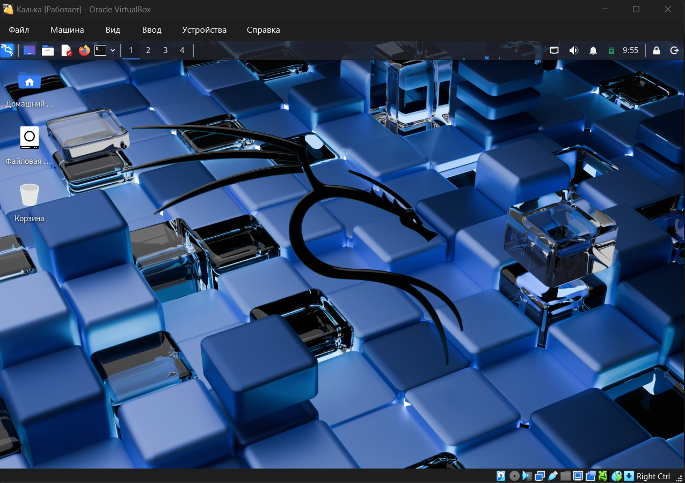

---
author:
  name: Самойлова Софья Дмитриевна
  email: 1132246736@rudn.ru
  affiliation:
    - name: Российский университет дружбы народов
      country: Российская Федерация
      postal-code: 117198
      city: Москва
      address: ул. Миклухо-Маклая, д. 6
title: "Отчёт по индивидуальному проекту. Этап №1"
subtitle: "Установка операционной системы Kali Linux на виртуальную машину"
date: today
date-format: "YYYY-MM-DD"
---

# Информация

## Докладчик

:::::::::::::: {.columns align=center}
::: {.column width="70%"}

  * Самойлова Софья Дмитриевна
  * Студентка
  * Российский университет дружбы народов
  * [1132246736@rudn.ru](mailto:1132246736@rudn.ru)

:::
::: {.column width="30%"}

:::
::::::::::::::

# Вводная часть

## Актуальность

- Умение устанавливать операционные системы — базовая компетенция IT-специалиста
- Kali Linux — специализированный дистрибутив для тестирования на проникновение
- Виртуальные машины позволяют осваивать новые ОС без влияния на основную систему
- Необходимость минимизации времени на развертывание рабочего окружения

## Объект и предмет исследования

- Объект исследования: процесс установки операционной системы
- Предмет исследования: дистрибутив Kali Linux и гипервизор Oracle VM VirtualBox

## Цели и задачи

- Цель: приобретение практических навыков установки Kali Linux на виртуальную машину
- Задачи:
  * Установка Kali Linux в VirtualBox
  * Первоначальная настройка системы
  * Получение базовой информации об установленной системе

## Материалы и методы

- Гипервизор: Oracle VM VirtualBox
- Дистрибутив: Kali Linux (64-bit)
- Интерфейс: командная строка Linux
- Методы: установка, настройка, сбор системной информации

# Выполнение лабораторной работы

## Создание виртуальной машины

- Скачаны необходимые программные продукты с официальных сайтов
- В VirtualBox создана новая виртуальная машина с параметрами:
  * Тип: Linux
  * Версия: Debian (64-bit)
  * Оперативная память: 2048 МБ
  * Жесткий диск: 20 ГБ
  * Подключен образ ISO Kali Linux

## Настройка виртуальной машины

{width=70%}

## Процесс установки

- Выбран графический режим установки ("Graphical install")
- Настроены язык, местоположение и раскладка клавиатуры
- Создана учетная запись обычного пользователя
- Настроен пароль для суперпользователя (root)

## Настройка учетных записей

{width=70%}

## Завершение установки

- Выбрана разметка диска "Использовать весь диск"
- Установлена базовая система и загрузчик GRUB
- Выполнена перезагрузка виртуальной машины
- Произведен первый вход в систему под созданной учетной записью

## Рабочий стол после установки

{width=70%}

# Информация о системе

## Параметры установленной системы

После установки с помощью команд терминала получена следующая информация:

- **Версия ядра Linux:** получена командой `uname -r`
- **Частота и модель процессора:** команды `lscpu` и `cat /proc/cpuinfo`
- **Объем оперативной памяти:** команда `free -h`
- **Тип гипервизора:** команда `systemd-detect-virt`
- **Тип файловой системы:** команда `lsblk -f` или `df -T /`

# Результаты

## Итоги работы

- Установлена операционная система Kali Linux на виртуальную машину
- Выполнена первоначальная настройка системы
- Освоены базовые команды для получения системной информации
- Приобретены практические навыки работы с гипервизором VirtualBox

## Заключение

В ходе выполнения лабораторной работы получены навыки установки специализированной операционной системы Kali Linux, необходимые для дальнейшего изучения дисциплин, связанных с информационной безопасностью и администрированием.

# Список литературы

## Использованные источники

1. Kali Linux Official Website — <https://www.kali.org/>
2. Oracle VM VirtualBox Official Website — <https://www.virtualbox.org/>
3. Материалы курса "Операционные системы" РУДН
