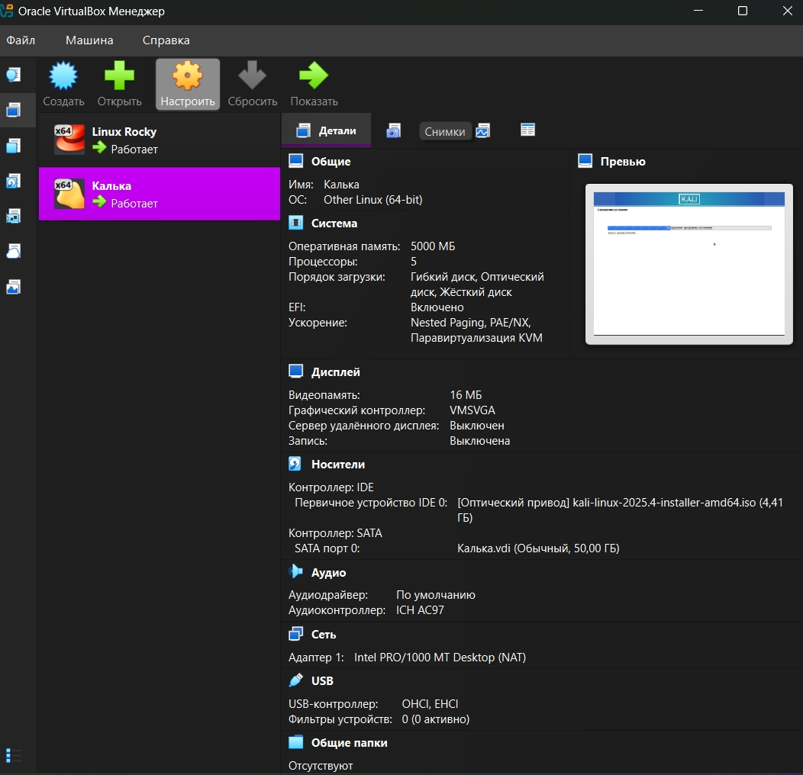
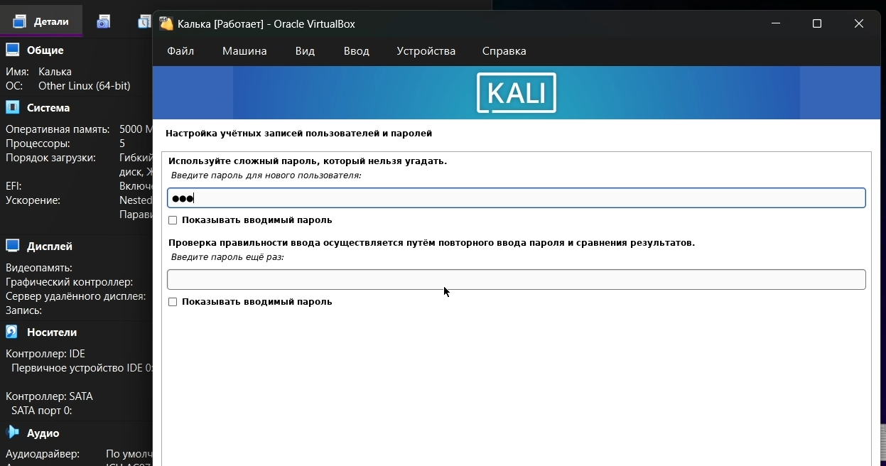

---
## Author
author:
  name: Самойлова Софья Дмитриевна
  email: 1132246736@rudn.ru
  affiliation:
    - name: Российский университет дружбы народов
      country: Российская Федерация
      postal-code: 117198
      city: Москва
      address: ул. Миклухо-Маклая, д. 6

## Title
title: "Отчёт по лабораторной работе №1"
subtitle: "Установка операционной системы Kali Linux на виртуальную машину"
license: "CC BY"
date: today
date-format: "YYYY-MM-DD"
---

# Цель работы

Целью данной работы является приобретение практических навыков установки специализированной операционной системы Kali Linux на виртуальную машину, ознакомление с интерфейсом командной строки и базовыми принципами настройки системы, ориентированной на тестирование на проникновение.

# Задание

1. Установка операционной системы Kali Linux на виртуальную машину.
2. Первоначальная настройка установленной операционной системы и знакомство с командами для получения системной информации.

# Теоретическое введение

Kali Linux — специализированный дистрибутив Linux на основе Debian, предназначенный для тестирования на проникновение, аудита безопасности и цифровой криминалистики. Разработан и поддерживается компанией Offensive Security.

В [табл. @tbl-distrib] приведено сравнение Kali Linux с другими дистрибутивами.

| Дистрибутив | Базовый дистрибутив | Назначение |
|--------------|---------------------|------------|
| Kali Linux | Debian | Тестирование на проникновение |
| Ubuntu | Debian | Универсальное использование |
| CentOS | RHEL | Серверное использование |
| Rocky Linux | RHEL | Серверное использование |

: Сравнение дистрибутивов Linux {#tbl-distrib}

# Выполнение лабораторной работы

Для выполнения работы было необходимо скачать гипервизор (Oracle VM VirtualBox) и дистрибутив операционной системы Kali Linux с официального сайта (<https://www.kali.org/>). Был выбран образ для 64-битных систем.

В программе VirtualBox была создана новая виртуальная машина с типом "Linux" и версией "Debian (64-bit)". Были выполнены предварительные настройки: выделено 2048 МБ оперативной памяти, создан виртуальный жесткий диск на 20 ГБ и подключен образ ISO для установки ([рис. @fig-001]).

{#fig-001 width=70%}

После запуска виртуальной машины началась загрузка установщика. Был выбран графический режим установки ("Graphical install"). В процессе установки были выбраны язык (Русский), местоположение и раскладка клавиатуры. Важным этапом является создание обычного пользователя и настройка пароля для суперпользователя (root) ([рис. @fig-002]).

{#fig-002 width=70%}

На этапе разметки диска был выбран вариант "Использовать весь диск" с последующей записью изменений на диск, после чего началась установка базовой системы. По завершении установки системы и загрузчика GRUB виртуальная машина была перезапущена. При первом входе в систему была использована учетная запись обычного пользователя. Графическая среда (Xfce) загрузилась автоматически ([рис. @fig-003]).

{#fig-003 width=70%}

После установки и входа в систему с помощью команд терминала была получена следующая информация:

- Версия ядра Linux (команда `uname -r`)
- Модель и частота процессора (команда `lscpu`)
- Объем доступной оперативной памяти (команда `free -h`)
- Тип обнаруженного гипервизора (команда `systemd-detect-virt`)
- Тип файловой системы корневого раздела (команда `lsblk -f`)

# Выводы

В ходе выполнения лабораторной работы были приобретены практические навыки установки операционной системы Kali Linux на виртуальную машину, выполнена ее первоначальная настройка и освоены базовые команды для получения системной информации, необходимой для дальнейшей работы.

# Список литературы

1. [Kali Linux Official Website](https://www.kali.org/)
2. [Oracle VM VirtualBox Official Website](https://www.virtualbox.org/)
3. Материалы курса "Операционные системы" РУДН
